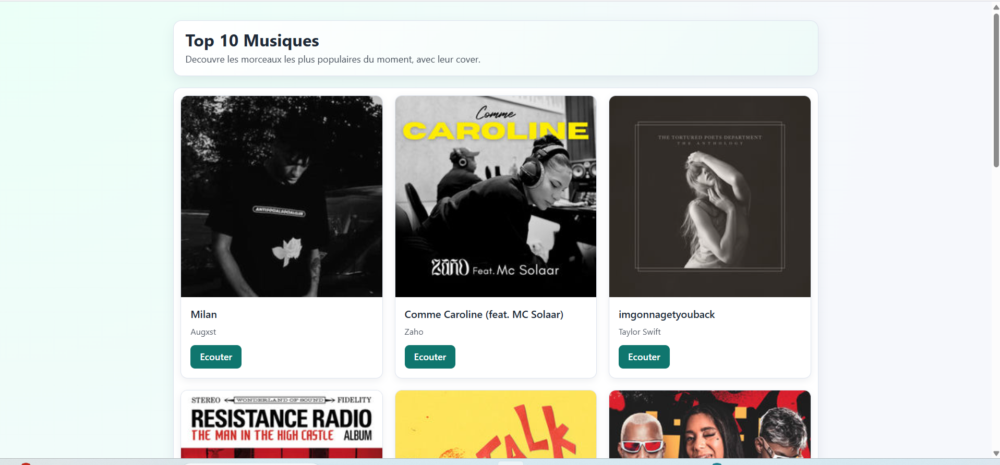

# Top 10 Music App

Cette application affiche les 10 morceaux de musique les plus populaires du moment en utilisant les données de l'API Deezer. Elle est construite avec une architecture moderne comprenant un frontend en React, un backend en Node.js/Express, et une base de données MongoDB. L'ensemble du projet est conteneurisé avec Docker pour un déploiement et un développement faciles.

## Aperçu de l'interface


*(Remarque: Remplacez `screenshot.png` par une capture d'écran réelle de votre application)*

## Technologies utilisées

- **Frontend**: React, TypeScript, Vite
- **Backend**: Node.js, Express.js
- **Base de données**: MongoDB
- **Conteneurisation**: Docker, Docker Compose

## Comment lancer le projet

Ce projet est entièrement conteneurisé. La seule pré-requis est d'avoir Docker et Docker Compose installés sur votre machine.

1.  **Clonez le projet** (si ce n'est pas déjà fait).

2.  **Lancez l'application avec Docker Compose** :
    Ouvrez un terminal à la racine du projet et exécutez la commande suivante :
    ```bash
    docker-compose up --build
    ```
    Cette commande va construire les images pour le frontend et le backend, puis démarrer les trois conteneurs (client, serveur, et base de données).

3.  **Accédez à l'application** :
    Une fois que les conteneurs sont en cours d'exécution, ouvrez votre navigateur et allez à l'adresse suivante :
    [http://localhost:5174](http://localhost:5174)

## Structure des services Docker

- **`client`**: Le service du frontend React. Il est accessible sur le port 5174.
- **`server`**: Le service du backend Node.js. Il communique avec la base de données et l'API de Deezer.
- **`mongodb`**: Le service de la base de données MongoDB, qui persiste les données dans un volume Docker.

